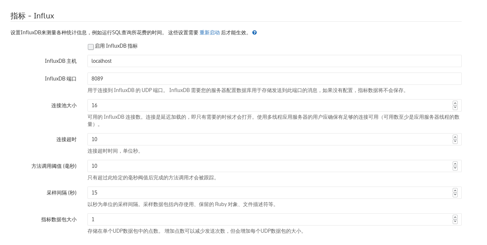

# Target

## gitlab

### Deploy docker gitlab

在容器中部署 gitlab 是简单的，[官方文档][gitlab docker]详解的非常详细。

### Limit resource

gitlab 部署在 docker 中，这里对其进行压力测试，并不希望它会吃掉所有宿主机的资源，
利用 docker 对容器[限定资源额度][limit containter resource]的方法，测试 gitlab 在固定资源量下的压力表现。

另外，限制资源的功能[只能在 docker-compose 2.2+ 的版本才可以][limit only in old version]，高版本 3.0+ 反而不行。

### metric

gitlab 部署之后，用root帐户，登陆gitlab后台，配置 influxdb 收集 metric，参考[官方文档][gitlab metric influxdb]。

- 启用influxdb指标，勾选
- 主机，ip地址
- 端口，保持默认，注意是udp端口，要在influxdb上开启对应端口
- 连接池大小，保持默认
- 连接超时，默认
- 方法调用阈值，默认
- 采样间隔，越小越好，设置为1
- 指标数据包大小，目前先保持为1，后续看收集情况

## cadvisor

### setup

启动 cadvisor 是简单的，原理就是将宿主机与 docker 数据相关的目录挂载到 cadvisor 容器中。

参考[官方文档][cadvisor setup]。

### metric

cadvisor 支持多种数据后端，配置 influxdb 参考这里，配置相应的启动参数。

参考[项目doc][cadvisor metric influxdb]。

[gitlab docker]: https://docs.gitlab.com/omnibus/docker/
[limit containter resource]: https://docs.docker.com/config/containers/resource_constraints/
[limit only in old version]: https://docs.docker.com/compose/compose-file/compose-file-v2/#cpu-and-other-resources
[gitlab metric influxdb]: https://docs.gitlab.com/ee/administration/monitoring/performance/influxdb_configuration.html
[cadvisor setup]: https://github.com/google/cadvisor/blob/master/README.md
[cadvisor metric influxdb]: https://github.com/google/cadvisor/blob/master/docs/storage/influxdb.md
